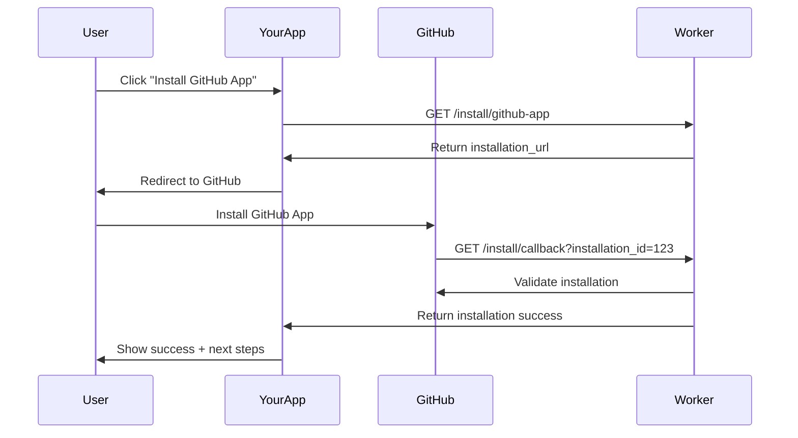

# GitHub App Installation API Design

## Current State
Hệ thống hiện tại chỉ có API quản lý cấu hình (`/config`) nhưng **không có API hỗ trợ installation flow**.

## Required Installation Endpoints

### 1. **Installation Initiation Endpoint**
```
GET /install/github-app
```
**Purpose**: Trả về GitHub App installation URL để redirect người dùng
**Response**:
```json
{
  "installation_url": "https://github.com/apps/YOUR_APP_NAME/installations/new",
  "app_name": "your-app-slug",
  "callback_url": "https://your-worker.domain.com/install/callback"
}
```

### 2. **Installation Callback Endpoint** 
```
GET /install/callback?installation_id=12345&setup_action=install
```
**Purpose**: Nhận callback từ GitHub sau khi user install app
**Query Params**:
- `installation_id`: Installation ID từ GitHub
- `setup_action`: "install" hoặc "update"
- `code`: Authorization code (nếu dùng OAuth flow)

**Response**:
```json
{
  "success": true,
  "installation_id": "12345", 
  "message": "GitHub App installed successfully",
  "next_steps": {
    "configure_webhook": "https://your-worker.domain.com/config",
    "test_webhook": "https://your-worker.domain.com/test"
  }
}
```

### 3. **Installation Status Check**
```
GET /install/status/{installation_id}
```
**Purpose**: Kiểm tra trạng thái installation và quyền
**Response**:
```json
{
  "installation_id": "12345",
  "status": "active",
  "account": {
    "login": "username",
    "type": "Organization"
  },
  "permissions": {
    "issues": "write",
    "contents": "read",
    "pull_requests": "write"
  },
  "repository_selection": "selected",
  "repositories_count": 5
}
```

## GitHub App Installation Flow



## GitHub App Configuration Requirements

### Setup URL trong GitHub App Settings
```
Setup URL: https://your-worker.domain.com/install/callback
```

### Webhook URL
```
Webhook URL: https://your-worker.domain.com/webhook/github
```

### Required Permissions
- **Issues**: Read & Write
- **Pull Requests**: Read & Write  
- **Contents**: Read & Write
- **Metadata**: Read

## Implementation Priority

### Phase 1: Basic Installation Flow
1. `GET /install/github-app` - Installation URL generation
2. `GET /install/callback` - Handle GitHub callback
3. Update existing `/config` endpoints to accept installation_id

### Phase 2: Enhanced Management  
1. `GET /install/status/{installation_id}` - Installation status
2. `DELETE /install/{installation_id}` - Uninstall handling
3. `GET /install/list` - List all installations

### Phase 3: User Experience
1. Web interface for installation process
2. Installation status dashboard
3. Configuration wizard

## Security Considerations

- **Webhook signature validation** cho tất cả GitHub requests
- **JWT authentication** cho GitHub App API calls
- **Installation ID isolation** trong Durable Objects
- **Rate limiting** cho installation endpoints

## Database Schema (Durable Objects)

```typescript
interface InstallationRecord {
  installation_id: string;
  app_id: string;
  account_login: string;
  account_type: 'User' | 'Organization';
  installed_at: string;
  updated_at: string;
  permissions: Record<string, string>;
  repository_selection: 'all' | 'selected';
  repositories_count?: number;
  status: 'active' | 'suspended' | 'uninstalled';
}
```

## Next Steps

1. **Implement basic installation endpoints** (Phase 1)
2. **Configure GitHub App Setup URL** pointing to your callback
3. **Test installation flow** với development app
4. **Add web interface** cho user-friendly experience
