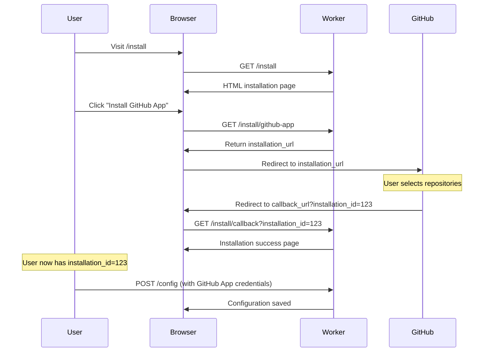

# GitHub App Installation Complete Flow

## 🎯 Overview

Hệ thống đã được nâng cấp với **complete installation flow** để hỗ trợ người dùng cài đặt GitHub App một cách dễ dàng.

## 🔧 API Endpoints

### 1. Installation Page (User Interface)
```
GET /install
```
**Mô tả**: Trang web đẹp để user có thể nhấn nút "Install GitHub App"
**Response**: HTML page với UI installation flow

### 2. Installation URL API
```
GET /install/github-app
```
**Response**:
```json
{
  "installation_url": "https://github.com/apps/your-app-name/installations/new",
  "app_name": "your-app-name",
  "callback_url": "http://localhost:8787/install/callback",
  "setup_url_note": "Make sure to set this callback_url as your GitHub App's Setup URL",
  "instructions": {
    "step_1": "Click the installation_url to install the GitHub App",
    "step_2": "Select repositories you want to grant access to", 
    "step_3": "GitHub will redirect back to callback_url with installation_id",
    "step_4": "Use the installation_id to configure the app via /config endpoint"
  }
}
```

### 3. Installation Callback Handler
```
GET /install/callback?installation_id=12345&setup_action=install
```
**Response**:
```json
{
  "success": true,
  "installation_id": "12345",
  "setup_action": "install",
  "message": "GitHub App installation received",
  "next_steps": {
    "configure": "POST http://localhost:8787/config",
    "webhook_url": "http://localhost:8787/webhook/github",
    "required_data": {
      "app_id": "Your GitHub App ID",
      "installation_id": "12345",
      "private_key": "Your GitHub App Private Key",
      "webhook_secret": "Your GitHub App Webhook Secret"
    }
  }
}
```

### 4. Installation Status Check
```
GET /install/status/12345
```
**Response**:
```json
{
  "installation_id": "12345",
  "status": "configured",
  "message": "Installation found in configuration",
  "config_status": {
    "appId": "✓",
    "privateKey": "✓",
    "webhookSecret": "✓", 
    "installationId": "✓"
  }
}
```

## 🔄 Complete Installation Flow



## 🛠️ GitHub App Configuration Required

### Step 1: Create GitHub App
1. Go to https://github.com/settings/apps/new
2. Fill in app details:
   - **App name**: `your-app-name`
   - **Homepage URL**: `https://your-domain.com`
   - **Setup URL**: `https://your-worker.domain.com/install/callback`
   - **Webhook URL**: `https://your-worker.domain.com/webhook/github`

### Step 2: Set Permissions
Required permissions:
- **Issues**: Read & Write
- **Pull Requests**: Read & Write  
- **Contents**: Read & Write
- **Metadata**: Read

### Step 3: Update Code
Replace `your-app-name` trong `/install/github-app` endpoint với GitHub App slug thực tế:

```typescript
const appName = "claude-code-assistant"; // Your actual GitHub App slug
```

## 📱 User Experience

### Before (API only)
```bash
# User phải gọi API thủ công
curl http://localhost:8787/install/github-app
# Phải copy URL và paste vào browser thủ công
```

### After (Complete UI Flow)
1. User visit `http://localhost:8787/install`
2. See beautiful installation page with features explanation
3. Click "Install on GitHub" button  
4. Automatically redirect to GitHub with repository selection
5. After installation, redirect back with success message
6. Clear next steps provided

## 🎨 UI Features

- **Modern Design**: Gradient background, rounded corners, smooth animations
- **Feature Explanation**: Clear list of what the app will do
- **Permission Warning**: Transparent about required permissions
- **Loading States**: Spinner during redirect process  
- **Error Handling**: Graceful error messages with retry options
- **Success Feedback**: Clear confirmation with next steps

## 🔧 Testing

```bash
# Test installation page
curl http://localhost:8787/install

# Test installation URL API
curl http://localhost:8787/install/github-app | jq

# Test callback (simulate GitHub redirect)
curl "http://localhost:8787/install/callback?installation_id=12345&setup_action=install" | jq

# Test status check
curl http://localhost:8787/install/status/12345 | jq
```

## 🚀 Next Steps

1. **Deploy to production** với real domain
2. **Create actual GitHub App** và update app name
3. **Set GitHub App Setup URL** pointing to your `/install/callback`
4. **Test complete flow** với real GitHub installation
5. **Add monitoring** cho installation success rate

## 💡 Benefits

- **User-friendly**: No technical knowledge required
- **Professional**: Modern UI builds trust
- **Transparent**: Clear permission explanations
- **Automated**: No manual copy-paste needed
- **Error-resilient**: Handles failures gracefully
- **Informative**: Provides clear next steps after installation
